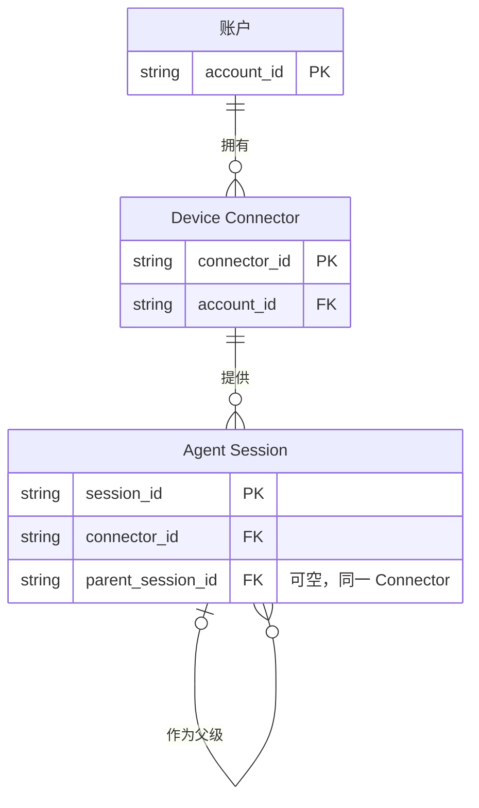

# Subsession 父子关系评审

## 待决定

- 为每个 Agent Session 增加可选父 Session 关系，且父子必须属于同一账户与同一 Device。
- Web 将有父级的 subsession 紧跟父 Session 缩进一级显示；不建立可折叠的通用会话树。

## 关键变化

| | Current | Proposed | Why |
| --- | --- | --- | --- |
| 会话关系 | Agent Session 彼此独立，协议、存储与 API 都没有父级字段。 | Agent Session 可通过 `parentSessionId` 指向同 Device 的另一个 Agent Session。 | Relay 能显示 VS Code 式的父子上下文，而不是仅补全一个无法解释来源的列表项。 |
| 列表投影 | 所有 Session 按活动时间扁平排序。 | 顶层 Session 保持排序；已知 subsession 紧跟父项缩进一级。 | 让父子任务保持邻近，同时避免引入折叠、展开与深层树交互。 |
| 缺失关系 | 无相关回退行为。 | 旧 Connector、父级缺失或关系未知时，Session 仍作为顶层项可见。 | 完整性优先，不能因为无法建立缩进而再次隐藏 subsession。 |

当前依据：[协议 `AgentSession`](../../../../../../packages/protocol/src/index.ts)、[Connector 的 Agent Host 映射](../../../../../../packages/connector/src/vscode-agent-host-provider.ts)、[Relay Session API](../../../../../../apps/worker/src/api.ts) 与 [`agent_sessions` 表](../../../../../../apps/worker/migrations/0004_connectors_and_agent_sessions.sql) 均只保存独立会话；[AHP Session 目录模型](https://microsoft.github.io/agent-host-protocol/reference/session.html)的 `SessionSummary` 没有通用父级字段。

## 目标业务模型

## 生命周期语义

| 实体 | 可变内容 | 关系结束方式 | 删除规则 | 评审意义 |
| --- | --- | --- | --- | --- |
| Agent Session | 标题、状态、活动时间与预览可随权威目录刷新；父级关系只按权威元数据写入或纠正。 | Session 可归档、关闭或消失；父级不可见不终止子 Session。 | 沿用现有 Connector 同步与保留规则，不级联删除 subsession。 | 父子关系只改变列表投影，不改变 Session 身份、命令或历史归属。 |

## 关键不变量

1. Session 的业务身份仍由账户、Connector 和 `sessionId` 共同确定；`parentSessionId` 不参与身份。
2. 父子 Session 必须属于同一账户和 Connector；禁止自引用与关系环。
3. 父级关系只能来自权威会话元数据，不得按标题、时间或列表相邻关系猜测。
4. 父级暂不可见、已过滤或尚未同步时，subsession 必须退化为普通顶层项，而不是被隐藏。
5. 子列表由 `parentSessionId` 派生，不另存可漂移的 children 集合；选择 Session 后的历史、消息和权限边界保持不变。
6. UI 只承诺一级视觉缩进；本期不提供折叠、展开、拖拽或任意深度树导航。

## 迁移与兼容性

- 协议与 Session API 增加可空 `parentSessionId`；旧 Connector 未发送时按 `null` 处理。
- `agent_sessions` 增加可空父级列，现有记录无需即时回填，并在后续权威目录刷新时逐步补充。
- 新 Connector 对尚未识别该字段的 Relay 必须保持现有 Session 同步能力；具体协议兼容方式在实施阶段以集成测试确认。
- 回滚 Web 投影时可以忽略父级字段并恢复扁平列表，不影响 Session 身份或历史数据。

## 未决实施风险

AHP `SessionSummary` 当前不提供通用父级字段。实施阶段必须确认实际 subsession 来源能否给出稳定父 Session ID；若只能发现 subsession 而不能确认父级，仍应将其同步并作为顶层项显示，不能推断关系。

是否批准以可选、同 Device 的 `parentSessionId` 表达父子关系，并仅在 Web 列表中缩进一级？
