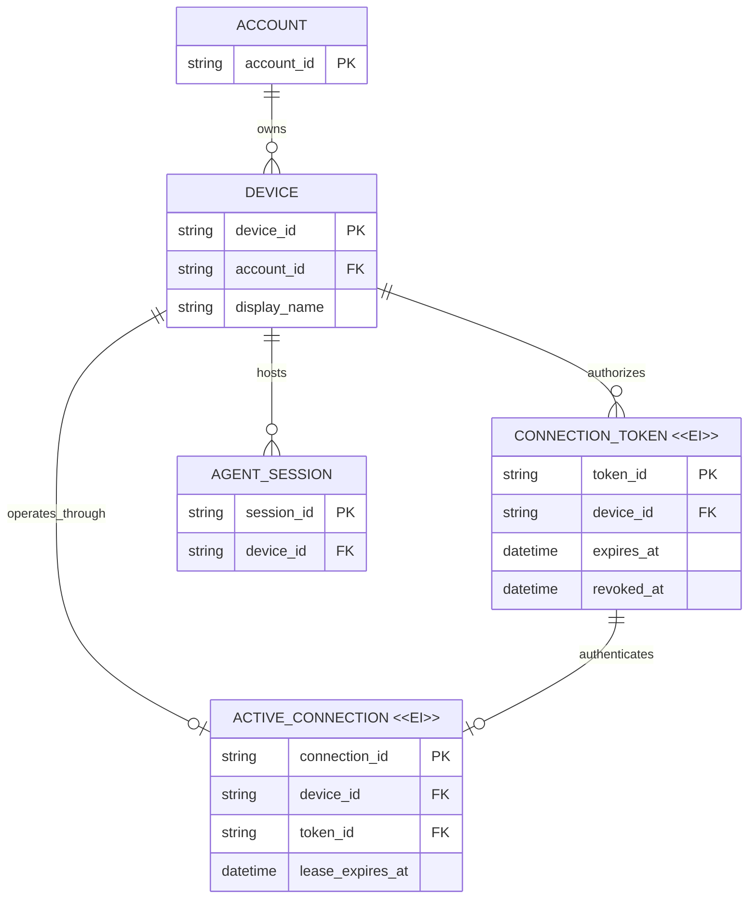

# 设备身份与单连接凭据：业务数据模型评审

## 待批准决定

- “设备”成为账户拥有的稳定身份，名称与归属由服务端管理。
- 连接 token 是设备的不可变凭据；每个 token 同时最多授权一个活跃连接。
- successor-token 无缝升级不在首期范围，但未来轮换不得改变设备身份或历史归属。

## 关键变化

| Current | Proposed | Why |
| --- | --- | --- |
| token 有 label，connector 另行声明 ID 与显示名 | 添加设备时一次性确定服务端设备 ID 与名称 | 消除重复命名和客户端伪造身份 |
| 一个 token 可配合多个 connector ID 建立连接 | token 固定属于一个设备，且最多有一个活跃连接 | 让凭据权限和在线状态可解释 |
| session 以客户端 connector ID 归属 | session 归属于稳定设备 | 重连、撤销和未来轮换不割裂历史 |

## 目标关系

`ACTIVE_CONNECTION` 是 Relay 运行时租约，不要求成为长期持久化业务记录；它出现在图中是为了明确单连接基数和失效语义。

## 生命周期语义

| 实体 | 语义 | 可变内容 | 有效性如何结束 | 删除规则与意义 |
| --- | --- | --- | --- | --- |
| Device | 可变 | 显示名、可用状态 | 由用户停用；凭据失效不改变身份 | 保留历史归属，删除须显式处理 session |
| Connection Token `<<EI>>` | 签发后身份与设备绑定不可变 | 仅记录使用观测；轮换产生新 token | 到期或撤销 | 可清理秘密材料，但保留最小历史归属 |
| Active Connection `<<EI>>` | 建立后 token、设备与连接 ID 不变 | 心跳续租 | 关闭、租约到期或 token 撤销 | 结束后可清理；同设备和 token 均最多一个活跃实例 |
| Agent Session | 可变 | 标题、状态和活动内容 | 按现有 session 生命周期 | 不因 token 撤销或轮换改变设备归属 |

## 关键不变量

1. Device 永远属于一个 Account；Connection Token 和 Agent Session 只能归属于同一账户内的 Device。
2. token 签发后不得改绑设备；需要新凭据时签发替代 token，而不是修改绑定。
3. 同一 token 和同一设备同时都最多存在一个有效 Active Connection；重叠连接被拒绝且不得中断既有连接。
4. Relay 从认证结果推导设备身份，不接受 connector 提交的 ID 或名称覆盖服务端事实。
5. 连接关闭、租约到期或 token 撤销必须原子释放活跃资格；命令不得路由给失效连接。
6. token 生命周期变化不得改变既有 Agent Session 的设备归属。

## 迁移与兼容性

- 现有 connector 记录优先保留为 Device 身份，已有 session 外键保持不变。
- 每个 token 只有一个历史 connector 关联时，可迁移为固定设备绑定。
- 同一 token 曾关联多个 connector 时不得自动猜测；发布前必须列出并要求显式拆分或选择归属。
- 兼容期可读取旧 CLI 的 connector ID 以完成一次性匹配，但服务端绑定后不得允许其改变身份。
- successor-token 的 prepare/commit 轮换属于后续需求；本模型通过 Device 与 Token 分离为其保留空间。

是否批准“服务端设备是稳定身份、token 固定绑定设备并严格单连接”的模型，按上述迁移边界进入实施设计？
