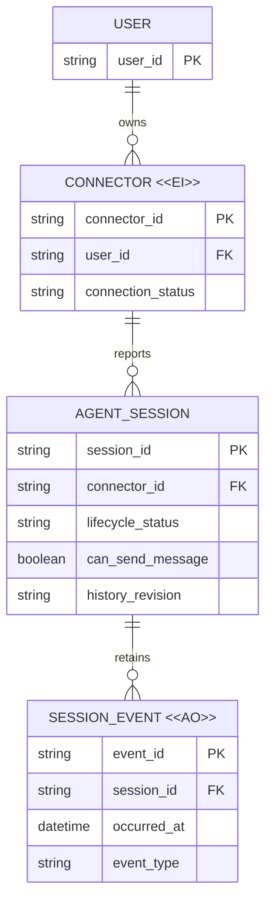

# Session 归档与历史保留模型评审

## 请求决定

- 将 `archived` 定义为可恢复、只读且历史可访问的生命周期状态。
- 仅将真实删除或永久不可寻址的 Session 表达为 `gone`。
- Session 状态变化不得改变已持久化事件的所有权、身份或保留语义。

## 关键变化

| 当前 | 拟议 | 原因 |
| --- | --- | --- |
| Done/归档被映射为 `gone`，历史 binding 随可见集合一起移除 | 归档保留稳定 Session 身份与只读历史定位，只禁用发送 | Done 是归档而非删除，历史仍属于同一 Session |
| `session.updated_at` 同时参与状态排序和历史新鲜度判断 | 历史使用独立 revision、同步时间或事件序列 | 状态变化不代表历史内容发生变化 |
| 同步失败可能表现为空 activities | 已存事件持续展示，同步结果单独表达 | 避免把“未同步”误解为“无历史” |

## 目标业务模型

## 生命周期语义

| 实体 | 可变内容 | 有效性如何结束 | 是否允许删除 | 评审意义 |
| --- | --- | --- | --- | --- |
| `CONNECTOR <<EI>>` | 身份与用户绑定固定；轮换产生新 Connector | 撤销、替换或明确清理 | 允许按既有账户/设备清理策略删除 | Session 复合身份不能因普通重连静默漂移 |
| `AGENT_SESSION` | 运行状态、归档状态、发送能力与独立历史 revision | 真实删除或上游确认永久不可寻址 | 仅按明确删除/保留策略 | `archived` 不等于 `gone`，状态变化不删除历史 |
| `SESSION_EVENT <<AO>>` | 正常操作只追加；更正以补偿事件表达 | 独立保留策略到期或所属主体明确删除 | 不因 Session 状态变化删除 | 已落库 activities 在离线或归档后仍可回看 |

## 关键不变量

1. `(user_id, connector_id, session_id)` 在 Session 生命周期内稳定标识同一记录，归档与恢复不得换键。
2. `archived` 令 `can_send_message=false`，但不令历史不可读；`gone` 只表示真实删除或永久不可寻址。
3. `SESSION_EVENT` 的读取授权来自 Session 所有权，不来自 connector 当前在线状态。
4. Session 状态更新时间与历史内容 revision 相互独立；前者不能单独使历史过期。
5. 已持久化事件优先返回；补同步失败是独立结果，不能以空数组伪装成功。

## 迁移与兼容性

- 现有 `gone` 记录无法仅凭当前字段可靠区分“归档”与“真实消失”；迁移需结合 Agent Host 可见性、事件来源或保守地保留历史。
- 现有 `agent_session_events` 不需要因状态拆分而重写，且不得被清理。
- Connector、Relay 与 Web 需要在兼容窗口内同时理解新生命周期；旧客户端仍上报 `gone` 时，Relay 至少继续返回已存事件。

## 未决事项

- Agent Host 是否能通过已知 resource 直接加载归档 Session，还是必须在 Done 前完成一次有结果的强制同步。
- `history_revision` 采用上游内容 revision、最后事件序列还是独立同步时间，留待实施阶段以协议能力决定。

是否批准以“归档只读但历史保留，真实删除才 gone”为目标生命周期模型？
